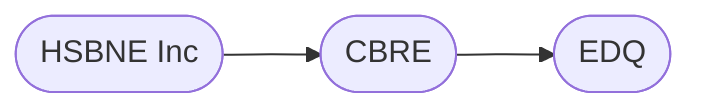

# The Beginning

### A short history

In 2009, David 'Buzz' read an article about hackerspaces in europe and thought, 'What a good idea'. So he dropped a pin on the map for brisbane on
hackerspaces.org and pretty soon had a small list of people emailing him asking about the 'Brisbane Hackerspace'. They got together at the Pig &
Whistle in the city, and decided to all put in $60/m each so they would have some cash to do something.

From there, they moved from the pub to under a domestic house for a short period, before getting the end of a small warehouse in Fortitude Valley. Eventually
taking over the whole warehouse, the lack of lease stability kept them looking. In 2012 the group negotiated to move into "Port Hack" at Northshore.
The site was derelict, so moving in meant 3 months of constant working bees to make the site usable. In 2015 the site was subdivided, and Northshore
Mens Shed and Team Arrow came onsite as tenants.

### The Port Hack Campus

HSBNE leases our home from the Queensland State Government, specifically Economic Development Queensland. The site is managed by CBRE Property
Managers. The chain of communication/management typically goes something like this:

### The Organisation

HSBNE Inc is an `Incorporated Association` in Queensland, Australia. That means that we are legally managed by the Office of Fair Trading, under the
Incorporated Associations Act. This means we are not a Company (Pty Ltd or just Ltd).
